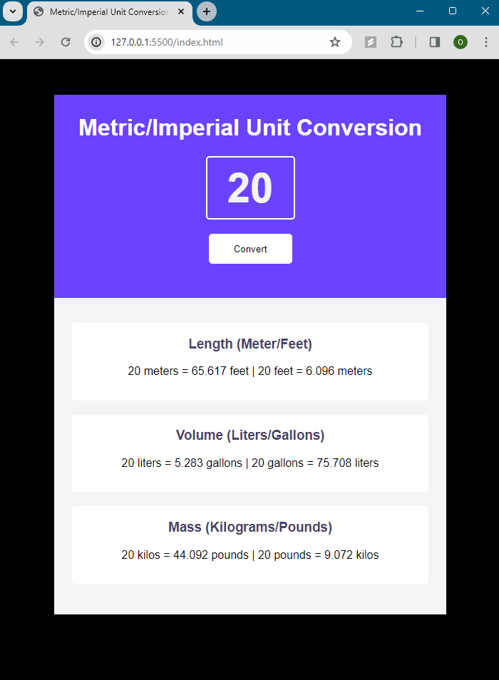

# Metric-Imperial-Unit-Converter App

Project generates all the unit conversions everytime you click the convert button.  

## Project Outline

- HTML and CSS provided structure and styling for the application.
- Javascript was used to take in input and convert it to speficied metric/imperial units. 